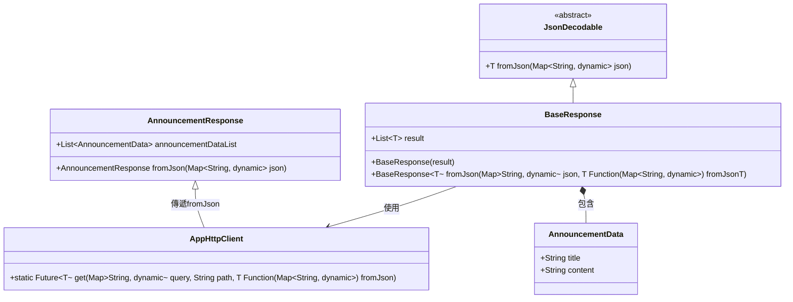

# JSON 解析設計架構分析與優化

## 前言

### 目的
在 Flutter 應用中，常常需要從後端 API 獲取 JSON 資料並轉換為應用中的物件模型。為了提高代碼的靈活性和重用性，設計了一個通用的解析架構，透過泛型和工廠函式來處理不同類型的 JSON 資料。


### 架構分析
下方是原始設計的架構圖，展示如何通過泛型 `T` 和工廠方法解析不同的 JSON 資料：


## 遇到的問題
在原始設計中，我們想利用抽象類別 `JsonDecodable` 來定義一個通用的 `fromJson` 方法，讓每個子類都能夠實現這個方法。然而，我們遇到了以下問題：

1. **泛型 `T` 無法初始化**：在 Dart 中，泛型 `T` 是在運行時才被確定的，無法直接透過 `T()` 來初始化物件。因此，無法在代碼中直接調用 `T().fromJson`，導致無法實現通用的 JSON 解析邏輯。

2. **靜態方法無法放在抽象類別中**：Dart 的抽象類別無法定義靜態方法，這使得我們無法將靜態的 `fromJson` 方法直接放在泛型的類型中。

## 如何解決
為了解決這個問題，我們採用了 **工廠方法模式**，將具體的 `fromJson` 方法作為函式參數傳遞，讓解析的邏輯與具體的物件類型解耦。這樣可以在不同的情境下傳遞不同的解析方法，而不需要依賴泛型的靜態初始化。

### 解決方案實現
#### 1. 抽象類別 `JsonDecodable`
定義一個抽象類別 `JsonDecodable`，其中包含一個 `fromJson` 方法：

```dart
abstract class JsonDecodable<T> {
  T fromJson(Map<String, dynamic> json);
}
```

#### 2. 基本回應類 `BaseResponse`
在 `BaseResponse` 中，我們利用工廠方法來動態解析不同類型的 JSON 資料：

```dart
class BaseResponse<T> extends JsonDecodable<T> {
  final List<T> result;

  BaseResponse({required this.result});

  factory BaseResponse.fromJson(Map<String, dynamic> json, T Function(Map<String, dynamic>) fromJsonT) {
    List<T> decodedResult = [];
    if (json['result'] is List) {
      for (var item in json['result']) {
        decodedResult.add(fromJsonT(item));  // 透過傳遞的 fromJson 函式來解析每一個 item
      }
    }
    return BaseResponse(result: decodedResult);
  }
}
```

#### 3. HTTP 客戶端處理
在 `AppHttpClient` 中，我們將 `fromJson` 函式作為參數，進行 HTTP 請求並處理回應：

```dart
Future<void> fetchAnnouncement(Map<String, dynamic> query) async {
  final announcementResponse = await AppHttpClient.get(
    query: query,
    path: 'announcement',
    fromJson: AnnouncementResponse.fromJson,  // 傳遞具體的 fromJson 函式
  );
  announcementState.value = announcementResponse.announcementDataList;
}
```

## 改善後的架構
經過優化後，我們通過將具體的 JSON 解析邏輯作為參數傳遞，解決了泛型 `T` 無法初始化的問題。這使得代碼更加靈活，同時保持了不同類型的資料解析邏輯解耦。

### 改善後的架構圖


這樣的設計架構不僅提升了代碼的可維護性，還使得未來若需要擴展新的資料類型時更加方便，只需在 `fromJson` 中實現新的解析方法即可，無需對整體架構進行大幅修改。
