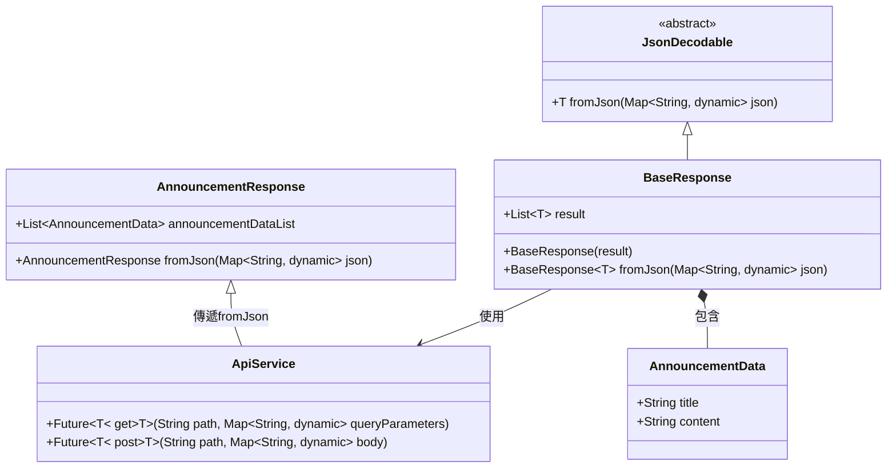

# Flutter 網路層的實作以及JSON decode 架構分析與優化

## 前言

### 背景與問題起源

在開發 Flutter 應用時，經常需要從 API 獲取 JSON 資料並將其轉換為具體的資料模型。起初設計了一個 `JsonDecodable` 抽象類別，期望每個繼承的資料類別都能實現 `fromJson` 方法，從而靈活地解析 JSON 資料。然而，**在實際調用過程中發現無法通過泛型類別正確調用 `fromJson` 方法**。問題的核心來自於 Dart 的泛型機制限制，泛型類型 `T` 無法在運行時通過 `T()` 來初始化實例，導致無法直接依賴 `T` 來進行解碼。

根據 Flutter 研究討論群的建議，問題的解決方案是通過**工廠函數模式**，將具體的 `fromJson` 函數作為參數傳遞 (`T Function(dynamic)`)，從而解耦資料的解析邏輯與類型定義，避免了依賴 Dart 泛型類型的靜態初始化問題。

### 目的

設計此架構的目的是**解決 Dart 中泛型類型無法初始化的問題**，並實現一個通用的 JSON 解析架構。在 API 回應資料中，應該能靈活使用泛型來解碼不同類型的 JSON 資料。這個文檔記錄了設計過程中的問題及其解決方案，並通過 Mermaid 圖表可視化最終的架構。

---

## 原架構分析

### 原架構問題

在原架構中，依賴的是 `JsonDecodable` 抽象類別，希望每個繼承的資料類別都實現 `fromJson` 方法。理論上這樣的設計能夠靈活處理不同資料類型的 JSON 解碼，但實際上遇到了幾個問題：

1. **泛型無法初始化**：在 Dart 中，泛型類型 `T` 是在運行時確定的，因此無法在編譯期通過 `T()` 來初始化一個泛型類型的實例，導致無法動態解析 JSON。
   
2. **靜態方法無法在抽象類別中實現**：Dart 的抽象類別無法定義靜態方法，這意味著無法將通用的 `fromJson` 靜態方法寫入 `JsonDecodable`，以解決資料解析的問題。

3. **API 回應資料結構不一致**：不同的 API 可能會返回單一物件或列表，原架構無法靈活處理這些結構，容易導致程式碼重複。

### 原架構圖

在原架構中，`JsonDecodable` 沒有辦法處理靜態泛型初始化，因此這樣的設計無法支持靈活的 JSON 解析。

### 原架構的問題總結

- 泛型無法初始化，無法在泛型類型中靜態調用 `fromJson` 方法進行 JSON 解析。
- 每個類別必須自己實現 `fromJson`，無法靈活適應不同的資料結構（如列表或單一物件）。

---

## 改善後的架構分析

### `fromJsonT` 的引入

在改善後的架構中，核心改進是引入了 **`fromJsonT`** 函數（`T Function(dynamic)`），這是解決 Dart 泛型限制的關鍵。`fromJsonT` 的引入使得 JSON 解析的責任從 `JsonDecodable` 的抽象類中抽離出來，並在運行時通過工廠函數傳遞具體的解析邏輯。這樣，避免了泛型靜態初始化的問題，並且提高了架構的靈活性。

### 為什麼不能在抽象類別中進行描述？

Dart 語言的限制在於，**抽象類別無法定義靜態方法**，而靜態方法是解決泛型解析的關鍵之一。泛型類型 `T` 是在運行時確定的，因此不能在編譯期依賴靜態的 `T.fromJson`。這正是設計上的一個痛點——無法在抽象類別中靜態地描述這些行為。

因此，透過引入 `fromJsonT`，我們將泛型的初始化與解析邏輯從抽象類別中分離出來，並作為參數傳入，使得資料的解碼可以根據具體的需求在運行時動態傳遞，而不依賴於靜態泛型。

### 改善後的架構圖

### 引入 `fromJsonT` 的影響

1. **靈活的資料解碼**：將 `fromJsonT` 作為參數傳遞，使得可以根據不同的回應格式傳遞不同的解析函數，靈活應對單一物件或列表結構，避免重複代碼。
  
2. **解決泛型初始化問題**：`fromJsonT` 抽離了泛型初始化的責任，這樣不需要依賴泛型的靜態初始化，克服了 Dart 的語言限制，從而提高了架構的可擴展性。

3. **職責分離**：將資料的解析職責從抽象類中移除，提升了架構的單一責任性。API 服務類專注於請求和回應處理，而具體的資料解析邏輯交給 `fromJsonT` 函數來處理。

---

## 改善後的架構總結

**改善前**：
- 每個類別必須自己實現 `fromJson`，且無法靈活處理不同的資料結構，容易導致重複代碼。
- Dart 的泛型限制導致無法通過泛型類型進行靜態初始化和解析。

**改善後**：
- 引入 `fromJsonT` 函數，將資料解析邏輯從泛型初始化中抽離出來，靈活處理不同資料結構。
- 架構更加靈活，無需依賴泛型類型的靜態初始化，同時提升了程式碼的可擴展性與可維護性。

---

## 後語

### 為什麼不能在抽象類別中進行抽象描述？

在 Dart 中，抽象類別雖然能夠定義抽象方法，但無法定義靜態方法。這帶來了泛型處理上的限制，特別是在涉及 JSON 資料解析時，無法依賴泛型類型 `T` 在運行時進行靜態初始化。

具體來說，Dart 的泛型類型僅在運行時才確定，因此無法在編譯期通過類似 `T().fromJson()` 的方式來動態初始化類型 `T`。這意味著，在抽象類別中，不能依賴泛型類型進行泛化的 JSON 資料解碼，因為無法預先知道具體的類型實例如何進行初始化。即使定義了抽象的 `fromJson` 方法，仍然無法通過泛型的靜態類型來執行實際的解碼邏輯。

這導致了在設計架構時必須選擇**工廠函數模式**，將具體的 `fromJson` 方法作為參數傳遞，從而解耦資料的解析邏輯與泛型類型的靜態初始化。這樣的設計能夠動態解析不同類型的資料，並且保證了架構的靈活性與擴展性，避免了 Dart 泛型系統的限制。

### 延伸討論：靈活與安全性之間的權衡

雖然工廠函數模式有效地解決了 Dart 泛型初始化的問題，但也帶來了一些權衡。引入 `fromJsonT` 函數作為參數，確保了解碼過程中的靈活性，然而這也要求每次進行 API 請求時，必須傳遞正確的解碼函數。如果沒有正確使用，可能會導致無法正確解析資料。因此，這樣的設計雖然靈活，但需要在設計時明確每個類別的解碼行為，並進行充分的單元測試來確保資料解析的準確性。

這一解決方案體現了在靈活性和安全性之間的權衡：通過工廠函數分離資料解析的職責，增加了架構的彈性，但同時也提高了使用者在應用這一模式時的責任。

### 特別感謝

感謝 Flutter 研究討論群中善解人衣的文率與不會通靈的工程屍提出的寶貴建議，幫助深入分析了 Dart 的泛型限制及其解決方案。透過討論和經驗分享，最終實現了這一靈活且通用的 JSON 解析架構，克服了泛型初始化的挑戰，並在不犧牲靈活性的前提下提升了程式設計的可擴展性。

---

這篇文檔希望能為未來進行 Dart 和 Flutter 開發時，提供一個解決泛型與資料解析問題的設計參考，也感謝所有參與討論的技術同仁。
