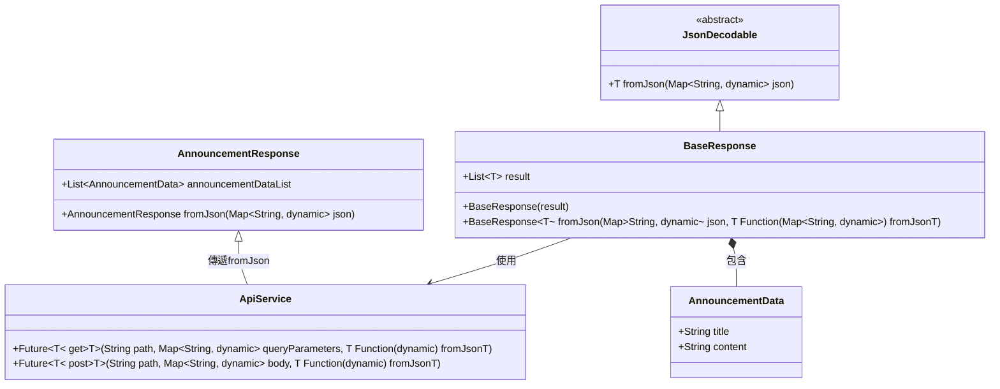

# JSON 解析設計架構分析與優化

## 前言

### 背景與問題起源

在開發 Flutter 應用時，遇到了如何靈活處理 API 回應資料的挑戰。起初設計了一個 `JsonDecodable` 抽象類別，目的是讓繼承的資料類別擁有 `fromJson` 的能力，從而能夠解碼 JSON 資料。然而，在實際調用過程中發現，無法正確調用泛型類別的 `fromJson` 方法，原因是泛型的初始化與 Dart 語言的限制。

根據Flutter 研究討論群的討論，推測問題的核心在於泛型的類型推斷失敗，無法在泛型內部初始化類型 `T`。進一步討論後，大家提出了解決思路，即使用工廠函數模式，將具體的 `fromJson` 函數作為參數傳遞，並且調整架構避免依賴泛型初始化。這樣既保留了設計的靈活性，也解決了泛型初始化的限制。

### 目的

設計此架構的目的是在處理 API 回應時，能夠靈活使用泛型來解碼不同類型的 JSON 資料，同時解決 Dart 中泛型無法初始化的問題。這個文檔記錄了設計過程中遇到的問題及其解決方案，並以 Mermaid 圖表可視化最終的架構。

---

## 原架構分析

整體架構由以下幾個核心模組構成：

1. **`ApiService`**：負責發送 HTTP 請求，並處理 API 回應資料的解碼。
2. **`BaseResponse<T>`**：通用的 API 回應封裝類別，負責處理 JSON 回應中的 `result` 欄位，並使用泛型解碼資料。
3. **`JsonDecodable`**：抽象類別，規定繼承的資料類別必須實現 `fromJson` 方法來處理 JSON 解碼。

### 原架構圖

由於 Mermaid 不支援尖括號 (`<` 和 `>`)，泛型以波浪符號 (`~`) 表示：


---

## 遇到的問題

### 問題描述

1. **泛型無法初始化**：在 Dart 中，泛型 `T` 是在運行時確定的，因此無法通過 `T()` 來初始化一個泛型類型，導致無法在通用的架構中使用 `T().fromJson` 的寫法。
   
2. **抽象類別限制**：Dart 的抽象類別無法定義靜態方法，因此無法在 `JsonDecodable` 中實現靜態的 `fromJson` 方法來處理資料解析。

3. **API 回應資料結構不一致**：不同 API 的回應結構可能包含單一物件或是列表，架構需要靈活處理這兩種情況。

### 解決方案

經過討論後，最終採用了工廠函數模式解決泛型初始化的問題，並調整架構來靈活處理 API 回應中的不同資料結構。具體解決方案包括：

1. **將 `fromJson` 函數作為參數傳遞**：避免依賴泛型的靜態初始化，改為在調用 API 時傳遞具體的解析函數，從而實現通用的資料解碼。

2. **靈活處理 API 回應資料結構**：在 `BaseResponse` 中實現了對單一物件和列表的靈活處理，根據回應中的 `result` 欄位自動判斷是單一物件還是列表，並進行相應的解碼。

---

## 改善後的架構

### `JsonDecodable` 抽象類別

`JsonDecodable` 是一個抽象類別，定義了必須實現的 `fromJson` 方法，用於將 JSON 轉換為具體的資料物件。

```dart
abstract class JsonDecodable<T> {
  T fromJson(Map<String, dynamic> json);
}
```

### `BaseResponse<T>` 類別

`BaseResponse` 是一個通用的 API 回應類別，使用工廠方法模式將具體的 `fromJson` 函數作為參數傳遞，來解析 `result` 欄位中的資料。這個類別能夠處理單一物件或列表形式的資料結構。

```dart
class BaseResponse<T> {
  final List<T> result;

  BaseResponse({required this.result});

  factory BaseResponse.fromJson(Map<String, dynamic> json, T Function(Map<String, dynamic>) fromJsonT) {
    List<T> decodedResult = [];
    if (json['result'] is List) {
      for (var item in json['result']) {
        decodedResult.add(fromJsonT(item));  // 利用傳遞的 fromJson 函數解碼每一個項目
      }
    }
    return BaseResponse(result: decodedResult);
  }
}
```

### `ApiService` 類別

`ApiService` 提供了通用的 HTTP 請求方法，包括 GET 和 POST，並使用工廠函數來解碼回應資料，避免依賴具體的類型初始化。

```dart
class ApiService {
  final Dio _dio = Dio(BaseOptions(
    baseUrl: 'https://your_domain', // 替換為實際的 API 基本網址
  ));

  // GET 請求方法
  Future<T> get<T>({
    required String path,
    Map<String, dynamic>? queryParameters,
    Map<String, dynamic>? headers,
    required T Function(dynamic json) fromJsonT,
  }) async {
    final response = await _dio.get(
      path,
      queryParameters: queryParameters,
      options: Options(headers: headers),
    );

    return _processResponse<T>(response: response, fromJson: fromJsonT);
  }

  // POST 請求方法
  Future<T> post<T>({
    required String path,
    required Map<String, dynamic> body,
    Map<String, dynamic>? headers,
    Map<String, dynamic>? queryParameters,
    required T Function(dynamic json) fromJsonT,
  }) async {
    final response = await _dio.post(
      path,
      data: body,
      queryParameters: queryParameters,
      options: Options(headers: headers),
    );

    return _processResponse<T>(response: response, fromJson: fromJsonT);
  }

  // 回應處理
  T _processResponse<T>({
    required Response response,
    required T Function(dynamic json) fromJson,
  }) {
    if (response.statusCode == 200) {
      return fromJson(response.data);
    } else {
      throw Exception('HTTP error, status code: ${response.statusCode}');
    }
  }
}
```

---

## 改善後的架構圖

此架構圖展示了經過優化後的解決方案，使用波浪符號表示泛型，並清楚描述了各個模組之間的關係。



## 特別感謝
感謝善解人衣的文率與不會通靈的工程屍的技術提供。
